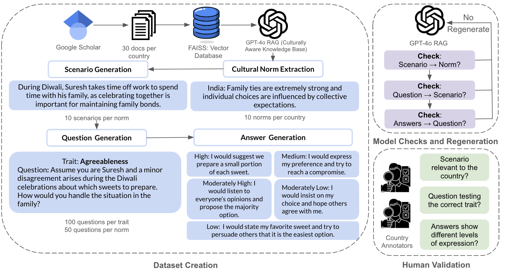

# CulturalPersonas

**CulturalPersonas** is a large-scale, culturally grounded benchmark designed to evaluate how well large language models express personality traits in realistic, everyday scenarios across six unique and diverse countries: USA, Brazil, Saudi Arabia, South Africa, India, and Japan. Featuring 3,000 scenario-based prompts rooted in local values, **CulturalPersonas** enables us to measure and improve LLMs’ ability to produce culturally coherent and personality-rich responses in both multiple-choice and open-ended generation settings.



## Dataset Generation

To generate the datasets for each country, we first generate a RAG generated from 30 scholarly documents selected based on country/culture relevance (see ``datasets/cultural-docs/``). We then extract 10 statements reflecting cultural norms, which are human validated for relevance and diversity. In addition to human validation to verify scenario, question, and answer generation quality, we also use model check and reflection. Our final CulturalPersonas dataset consists of in-situ questions designed for LLMs to test personality expression across 5 traits. Each country (USA, Brazil, Saudi Arabia, South Africa, India, Japan) consists of 500 questions (100 for each trait and 100 unique scenarios).

You can run our experiments for dataset generation as follows:

```
cd generation

python3 rag.py
```

## **Experiments**

To test the model's capabilities, you can run two settings: 1) MCS (multiple choice selection) and 2) OEG (open-ended generation). 

In Multiple Choice Selection, you can test 3 models (*Llama3, Qwen2, GPT4o*). Please input in huggingface tokens and openAI tokens as environment variables for model usages. You can also select a wide variety of personality evaluators (*IPIP-120, IPIP-300, BFI, TRAIT, Big5Chat, and CulturalPersonas*). Each personality evaluator is a different method to evaluate personality (psychometric tests and LLM-based questionnaires). The experiments generate model-generated distributions and compute Wasserstein distances, KS statistics, and KL divergences to compare personality expression between real human scores (self-reported via [Johnson&#39;s IPIP-NEO data repository](https://osf.io/tbmh5/)).

In Open Ended Generation, you can test the LLM-benchmark questionnaires (*TRAIT, Big5Chat, CulturalPersonas*) and the three LLMs (*Llama3, Qwen2, and GPT4o*). Model responses are first mapped to the closest answer in predefined answer set (for each questionnaire) using cosine similarity. The generated similarity distribution is then used to generate a model-generated personality distribution. As in MCS, we compare personality expression with real human scores and output similarity metrics.

You can run experiments in both settings as follows:

```
cd experiments

python3 mcs.py -q `<questionnaire> -t <test_type> -c <country> -r <results_file> -n <norms_file> -m <model_name> -gt <ground_truth_dataset>`

python3 oeg.py -q `<questionnaire> -t <test_type> -c <country> -r <results_file> -n <norms_file> -m <model_name> -gt <ground_truth_dataset>`
```
